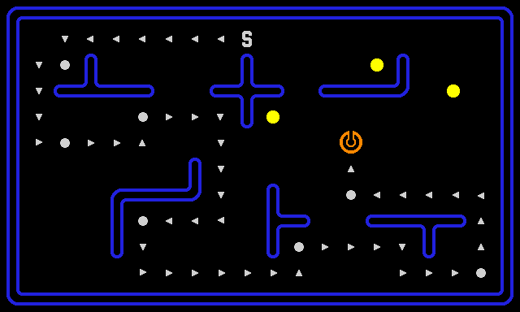
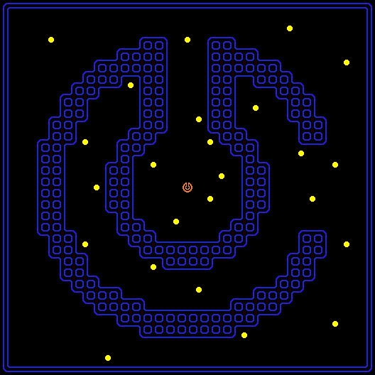

# Chem-Man Challenge
Tired of repetitive tasks? Want to work on interesting problems?<br/>
**Try your hand at this algorithmic challenge from [Chemaxon](https://chemaxon.com/)!**

<br/>



<br/>


## What's this all about?
This is an algorithmic challenge for developers with a theme inspired by the iconic game
[Pac-Man](https://en.wikipedia.org/wiki/Pac-Man). Your goal is to find a route throughout a maze
to collect coins with as few steps as possible.
This challenge is open to everyone with the aim of having fun while solving a complex
optimization problem. You can also compete with others, either on the global toplist or with
your friends or co-workers.

If you would like to share your solutions, you can send them to us, especially if you made
your way to the [toplist](#toplist). And as you may guess, we are [hiring](#about-chemaxon). ;)

## The challenge
The theme of this challenge recalls retro computer games, especially Pac-Man, so let's call
our character the **Chem-Man**. Your task is to navigate the Chem-Man in a maze in order to
collect all coins with the minimum number of steps. Moreover, to make the game more interesting,
the Chem-Man can also climb the walls!

### Input
The input of the task is a maze described in a text file in the following format.
The first line contains two positive integers: `W` and `H`, separated by space.
The maze itself is described by the next `H` lines, each of which contains `W` characters.
These characters specify the individual tiles of the maze as follows.

* `.`: an empty tile
* `#`: a wall section
* `c`: a coin to be collected
* `s`: the starting position of the Chem-Man

All input files are valid, you don't need to validate them.

### Output
At the beginning, the Chem-Man is at a given location of the maze, heading North.
A solution (route) is described by a string consisting of the following characters.

* `N`, `E`, `S`, `W`: turn to North, East, South, West (respectively)
* `F`: step forward (to the current direction)
* `U`: climb up the wall in front of the Chem-Man, starting from a non-wall tile
* `D`: climb down from a wall into a non-wall tile in front of the Chem-Man

Forward steps are valid if and only if both the start tile and the destination tile are
not walls or both are walls. That is, the Chem-Man can also walk on the top of walls.

### Score
Climbing up or down to/from walls takes 8 times as much time as a simple step (a forward step
or a turn move). So the total score of a solution string is the number of simple steps plus
8 times the number of climbing steps, and your goal is to minimize this score.

Unnecessary turn steps may also occur in a solution string, but you should try to avoid them
to decrease the total score. For example, `EFNWFNFNFNF` is equivalent to `EFWFNFFF`.


## Examples

### Example 1

#### Input
```
8 4
s.......
#######.
.c...#..
.....c..
```

#### Output
Two possible solution strings:
* `EFFFFFFFSFFFWFFFFFFNF` with score `21`
* `SUDEFSFEFFFF` with score `26`

### Example 2

#### Input

```
10 6
..........
...####...
.s.#......
#########.
#c..#..#..
#......c..
```

#### Output
Two possible solution strings:
* `FFEFFFFFFFFSFFFFFWFFFFFFFFNF` with score `28`
* `SUDFEFFFFFF` with score `25`

So it is worth to climb through the wall in the second example, while it is better to bypass it
in the first example.

## Mazes
The **mazes** folder contains the input files. **simple.in** describes a small maze for
development and testing. **level1.in**, **level2.in**, and **level3.in** define the three levels
of the challenge with increasing maze size and complexity.

For the **simple.in** input, a solution with a score of at most 100 is nice.
The best score is 88, which can be achieved in multiple ways, for example, by this solution string.
```
EFFFFFSFFWFFFSFWFSFFEFFFFFFFNFFEFSFFFFFFWFFFFFFFNFSFWFFFFFFNFFEFFFNFFFFWFFFFFFSFWFNFFFEF
```

## How to validate solutions
To make this challenge more fun, a simple application is provided to visualize the mazes
and your solution strings. It also validates your solutions and calculates the scores.
In accordance with the retro theme, this is not an online service, but a desktop application,
written in Java. It can be found in the **viewer** folder, and can be executed like this
(using Java 11 or newer version).
```
java -jar viewer/chem-man.jar
```
An input file and (optionally) an output file can also be passed as command line arguments.
```
java -jar viewer/chem-man.jar mazes/level1.in
java -jar viewer/chem-man.jar mazes/level1.in mysolution.out
```

## Toplist
The current toplist can be found in **[toplist.md](toplist.md)**.
The results are ranked based on the total score for the three levels, which is to be minimized.

If you would like to share your results with us and participate in the competition, send your
solution strings for the three levels via email to **challenge@chemaxon.com**.
And let us know if you would like us to add your results to the toplist with your name,
an account ID, or even anonymously. However, please do not share solution strings on any
public forum except for the scores you achieved.

## About Chemaxon
[Chemaxon](https://chemaxon.com/) is a leading software company developing applications and
services for chemistry and biology. Our clients involve the largest pharmaceutical companies
all over the world.
And we are continuously hiring talented developers, mainly to our head office in Budapest, Hungary.

Our teams deal with complex challenges on a daily basis, and we have open positions for
a variety of skill sets. So if you like this challenge, or we've piqued your interest,
your application is welcome. Especially if you achieved a good result, as it can be an awesome
boost for a hiring interview, but of course, it's not a requirement.
For more information, see [https://chemaxon.com/jobs/](https://chemaxon.com/jobs/).

<br/>


